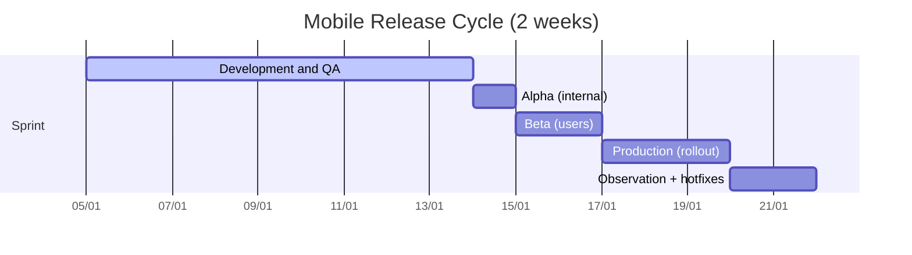
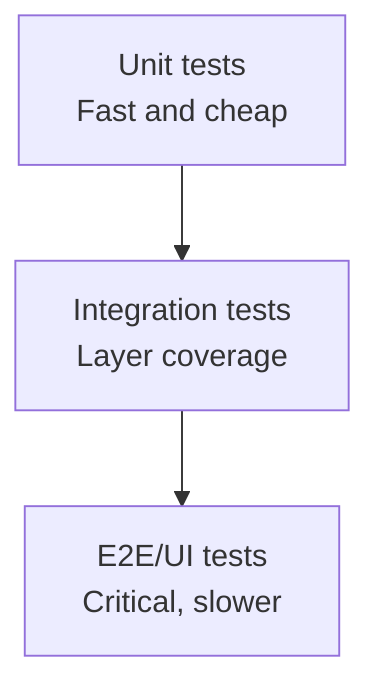

# The Importance of Quality in Mobile Application Development

On October 29, 2025, I had the opportunity to participate in the Cyber Break program on TVN Radio where I spoke about the importance of quality in mobile application development and how we can improve it. In the mobile world, there are different challenges than on other platforms: device fragmentation, variable connectivity, and store restrictions mean that a small bug can become a loss of users and reputation.

In this article, I want to provide a practical guide: what we mean by quality, why it impacts business, and what are the concrete practices that elevate stability in production.

## Why is software quality important in my mobile application?

The importance of software quality can be clearly seen in sensitive applications such as medical or aerospace software. If something fails, it can cause a patient's death or a plane crash. Therefore, it is essential that software quality is high to ensure the security and reliability of the application.

In the case of mobile applications, software quality is critical because there is great competition in the market. If a user perceives poor quality (crashes, bugs, slow screens), they tend to abandon the app, leave a bad review, and not return. This affects positioning in the store, reduces organic downloads, and increases user acquisition costs.

A study conducted by Bugsnag in 2021 found a correlation between applications with high stability (99% crash-free sessions) and high ratings in stores. This tells us that software quality is a key factor for success.

**Quality is not just "not having bugs"**. It also includes: performance, accessibility, security, consistent design, and a predictable experience under real conditions (low battery, intermittent network, old versions).

## Challenges in Mobile Application Development

In his book "Building Mobile Apps at Scale", Gergely Orosz describes a series of common challenges in mobile. Some of the most relevant are:

- The long tail of old versions
- Unstable connectivity and offline
- Crashes and ANRs
- Complex state management and multiple data sources
- Hardware differences (RAM, CPU, screen size)

### The Long Tail of Old Application Versions

The long tail of old versions is an important challenge. Users can remain weeks (or months) without updating. This forces maintaining compatibility with old APIs, data schemas, and flows that are no longer on the roadmap. A good release process must have strategies for gradual migration and backend communication.

### Intermittent Connectivity

The real experience includes tunnels, elevators, areas without signal, or saturated networks. Your app must handle timeouts, retry with backoff, local cache, and offline states without blocking the UI.

### Crashes and ANRs

A crash can occur due to lack of memory, concurrency errors, or external dependencies. On Android, ANRs (Application Not Responding) destroy the experience. Quality requires continuous monitoring and time limits for heavy operations.

### Complex State Management

On mobile, we coexist with multiple layers: UI, local cache, network, push notifications, and deep links. Without a clear state strategy (unidirectional, sources of truth), inconsistencies appear that are difficult to debug.

## Improving Software Quality in My Mobile Application

To improve software quality in a mobile app, I propose a strategy that combines processes, automation, and measurement. It's not about adding tools randomly, but building an end-to-end quality system.

### 1) Staged Deployment Processes

Launching to all users at the same time is risky. On mobile, staged release allows detecting problems before massive impact. A typical flow includes Alpha (internal team), Beta (trusted users), and Production.

Deployment flow diagram:

Suggested cadence: 2-week cycles, with observation windows between stages.

### 2) Maintain High Code Maintainability

Quality starts with code that's easy to change without fear. This includes:
- Clear architecture (for example, MVVM, MVI, or Clean)
- Well-defined modules and low coupling
- Updated dependencies with controlled versions

### 3) Robust Test Suite (Testing Pyramid)

You don't need UI tests for everything. A balanced strategy reduces costs and increases confidence:
- **Unit** tests for business logic
- **Integration** tests for databases and APIs
- **End-to-end** tests for critical flows (login, payment, onboarding)

### 4) Feature Flags + Small and Frequent Changes

Implementing features behind flags allows launching without exposing all users. Additionally, small changes reduce risk and facilitate rollback.

### 5) Monitoring and Observability

It's difficult to detect all failures before release. Therefore, you need monitoring of:
- Crashes and ANRs
- Network errors
- Performance metrics (cold start, render time)
- Business events (funnel, conversions)

### 6) Security and Privacy by Design

Quality also includes protecting data and complying with regulations:
- Encryption in transit and at rest
- Minimum necessary permissions
- Review of dependencies with known vulnerabilities

### 7) Automation in CI/CD

A well-designed pipeline avoids human errors and reduces time:
- Lint + static analysis
- Tests in parallel
- Reproducible builds
- Automatic distribution to testers

## Pre-Production Release Checklist

Before publishing, validate this minimum list:
- Crash-free sessions > 99%
- Low and stable ANR rate
- Critical E2E tests passing
- Changes documented for support and product
- Rollback plan defined

## Metrics I Recommend Tracking

Measuring quality is what allows continuous improvement:
- Crash-free sessions
- ANR rate
- Startup time (cold start)
- Error rate per endpoint
- NPS or store ratings

## Conclusion

Quality in mobile applications is not a final state, but a system. With staged processes, balanced testing, observability, and a continuous improvement approach, it's possible to reduce failures and build reliable experiences that users value.

- Staged deployment processes
- Maintain high code maintainability
- Maintain a robust test suite
- Use feature flags to launch new features in a controlled manner. This together with managing small and frequent changes.
- Use an error monitoring system to detect and correct errors quickly. It's very difficult to detect all possible failures in a mobile application, so it's important to have an error monitoring system that allows us to detect and correct errors quickly.
