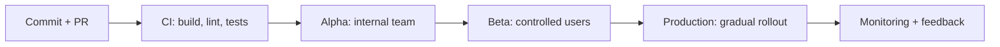
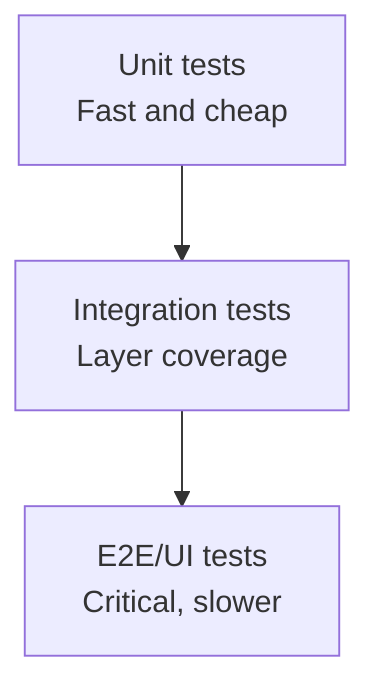
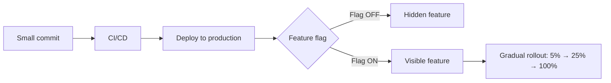

# The importance of quality in mobile app development

On October 29, 2025, I had the opportunity to participate in TVN Radio's Cyber Break program where I talked about the importance of quality in mobile app development and how we can improve it. In the mobile world, there are challenges different from other platforms: device fragmentation, variable connectivity, and store restrictions can turn a small bug into a loss of users and reputation. I didn't want to miss the opportunity to share this topic with all of you.

In this article, I want to provide a practical guide: what we understand by quality, why it impacts the business, what challenges exist in mobile app development, and what concrete practices elevate stability in production.

## Why is software quality important in my mobile application?

The importance of software quality can be clearly seen in sensitive applications such as medical or aerospace software. If something fails, it can cause the death of a patient or the crash of an airplane. Therefore, it is essential that software quality is high to ensure the safety and reliability of the application.


In the case of mobile applications, software quality is critical because there is great competition in the market. If a user perceives poor quality (crashes, bugs, slow screens), they tend to abandon the app, leave a bad review, and never return. This affects store positioning, reduces organic downloads, and raises user acquisition costs.

A [study conducted by Bugsnag in 2021](https://smartbear.com/news/news-releases/bugsnag-application-stability-index-report-reveals/) found a correlation between applications with high stability (99% crash-free sessions) and high ratings in the stores. This tells us that software quality is a key factor for your application's success.

**Quality is not just "not having bugs"**. It also includes: performance, accessibility, security, consistent design, and a predictable experience under real conditions (low battery, intermittent network, old versions).

## Challenges in mobile app development

In his book ["Building Mobile Apps at Scale"](https://www.mobileatscale.com/), Gergely Orosz describes a series of challenges (39 in the latest version) common in mobile. Some of the most relevant are:

- The long tail of old versions
- Unstable and offline connectivity
- Crashes and ANRs
- Complex state management and multiple data sources
- Hardware and operating system differences (fragmentation)

### The long tail of old application versions

The long tail of old versions is an important challenge. Users can remain weeks (or months) without updating. This forces maintaining compatibility with old APIs, data schemas, and flows that are no longer on the roadmap. A good release process must have gradual migration strategies and backend communication. Before the new version is published in production, there must be a gradual migration plan so that any critical error is detected and corrected before production users notice it.

There are applications, such as banking apps, that block the application if users haven't updated to the latest version. Stores are also launching new features that help users update to the latest version of the application. For example, Google Play offers ["In-app updates"](https://developer.android.com/guide/playcore/in-app-updates) so users can update the application without having to download the new version from the store.


### Intermittent connectivity

When developing a mobile application, you must keep in mind that connectivity is variable and that the user can be anywhere in the world. Therefore, your application must be able to handle intermittent and offline connectivity. Real experience includes tunnels, elevators, areas without signal, or saturated networks. If connectivity is not handled correctly, an application state that is not expected by the user can occur, or simply offer a poor user experience (UX).


Your app must handle multiple critical aspects of connectivity without blocking the UI:

**Timeouts**: Define appropriate wait times for each network operation (typically 5-30 seconds depending on the action). Without timeouts, operations can hang indefinitely, consuming resources and degrading the experience. Implement different timeouts based on criticality: fast operations like searches should fail quickly, while heavy downloads can have longer windows.

**Retry with backoff**: When a request fails (due to timeout or network error), don't immediately try again. Implement a retry strategy with exponential backoff (e.g., wait 1s, then 2s, then 4s before retrying). This avoids saturating the network when there are temporary problems and reduces battery consumption. Limit the maximum number of attempts (typically 3-5) to avoid infinite loops.

**Local cache**: Save critical data locally to allow the app to work offline or with slow connection. Common strategies include HTTP response caching (with stale-while-revalidate validation), image and asset caching, and app state persistence. The cache must have a clear invalidation policy: time-sensitive data (like prices) should be refreshed frequently, while static content can persist for days.

**Offline states**: Design your app to explicitly detect and handle lack of connectivity. Show clear visual indicators when the user is offline, allow operations that can be done locally (reading, form editing), and sync pending changes when connectivity is restored. Implement pending operation queues for actions that require network.

**Without blocking the UI**: All these operations must run in background threads or asynchronously. The main thread (UI thread) should never wait for network operations. Use callbacks, promises, or coroutines according to your technology stack, and show appropriate loading states without freezing the interface. [Kotlin coroutines](https://kotlinlang.org/docs/coroutines-overview.html) is an excellent option for handling asynchrony in Android. It offers a high-level API for handling asynchrony simply and efficiently.

The user experience must be consistent regardless of connectivity: the app should feel responsive and predictable whether on 5G, slow WiFi, or no connection. A user in a tunnel should be able to continue browsing previously loaded content without noticing abrupt differences.


### Crashes and ANRs

A **crash** is an unexpected failure that causes the application to close abruptly without prior notification to the user. That is, the app stops working and the operating system forcibly terminates it. A crash can occur due to lack of memory, concurrency errors, external dependencies, or a Null Pointer Exception.

On Android, **ANRs (Application Not Responding)** represent an application block for more than 5 seconds during which the user cannot interact with the application. This completely destroys the user's experience with your application. These types of errors are critical and must be continuously monitored because they can affect a large number of users, which leads to users not returning to use the application and leaving a bad review in the store.

Quality requires continuous monitoring and time limits for heavy operations.

### Complex state management

Unlike web and backend development, where the application lifecycle is not a critical problem, in mobile we must handle constant lifecycle transitions. The application can be sent to the background when the user switches to another app, and then return to the foreground when they come back. Furthermore, the operating system can reclaim memory when under pressure, which in some cases terminates the application completely. When the user opens it again, the app must restore its previous state transparently.


*Image from ["Building Mobile Apps at Scale"](https://www.mobileatscale.com/)*

In mobile, we coexist with multiple layers: UI, local cache, network, push notifications, and deep links. Without a clear state strategy (unidirectional, sources of truth), difficult-to-debug inconsistencies appear. Most bugs and crashes occur due to unexpected or untested combinations of events.

## Improving software quality in my mobile application

To improve software quality in a mobile app, I propose a strategy that combines processes, automation, and measurement. It's not about adding tools randomly, but about building an end-to-end quality system.

### 1) Staged deployment processes

Launching to all users at the same time is risky. In mobile, staged release allows detecting problems before a massive impact. A typical flow includes Alpha (internal team), Beta (trusted users), and Production.

Deployment flow diagram:



Suggested cadence: 2-week cycles, with observation windows between stages.


#### Google Play Console (Android)

Google Play offers a complete track system for staged deployments:

- **Internal testing**: Up to 100 internal testers. Builds are available immediately without Google review. Ideal for development team and QA testing.
- **Closed testing (Alpha/Beta)**: Allows creating closed user groups by email or Google Groups. Builds go through a quick review. Useful for testing with stakeholders or trusted users.
- **Open testing**: Any user can join the testing program from the app's Play Store page. Good for getting feedback from a wider audience before general launch.
- **Staged rollouts**: Once in production, you can release to a percentage of users (1%, 5%, 10%, 50%, etc.) and gradually increase. If you detect problems in monitoring, you can pause the rollout or rollback to the previous version.

Google Play Console also provides Android Vitals metrics (crash rate, ANR rate, battery usage) that allow you to compare stability between versions during rollout.

#### App Store Connect (iOS)

Apple offers similar tools through TestFlight and phased releases:

- **TestFlight Internal**: Up to 100 team members with App Manager, Developer, Marketer, or Admin roles. Builds are available immediately after processing.
- **TestFlight External**: Up to 10,000 external testers per app. Requires Apple review (generally 24-48 hours for the first build of a group). You can create multiple groups with different builds.
- **Phased Release**: When publishing to production, you can enable "Phased Release for Automatic Updates" which gradually distributes the update over 7 days (1%, 2%, 5%, 10%, 20%, 50%, 100%). Users who manually check for updates get it immediately, but automatic updates are gradually distributed. You can pause the rollout if you detect problems.

TestFlight allows collecting direct feedback from testers through the app, including screenshots and comments, making it easier to identify problems before production.

#### Recommendations for both platforms

1. **Automate distribution**: Use tools like Fastlane to automatically upload builds to testing tracks from your CI/CD.
2. **Define promotion criteria**: Establish minimum metrics (crash-free rate > 99.5%, no P0 bugs) before advancing to the next track.
3. **Actively monitor during rollouts**: Have dashboards ready with key metrics and alerts configured to detect regressions.
4. **Document the rollback process**: Ensure any team member can pause a rollout or revert to a previous version if necessary.

### 2) Maintaining high code maintainability

Quality starts with code that's easy to change without fear. This includes:
- Clear architecture (for example, MVVM, MVI, or Clean)
- Well-defined modules and low coupling
- Updated dependencies with controlled versions

As the application grows, it's important to maintain code maintainability. This means the code must be easy to understand, maintain, and change. Mobile applications are developed as monoliths, but it's important that the code is modularizable so it can be maintained and changed easily. This allows the development team to work on different parts of the application independently without affecting the rest of the application, and also improves the developer experience (DX) since, if properly modularized, compilation and testing times can be reduced when working on the project.

Using static analysis and linting tools helps keep the code clean and error-free. Tools like [SonarQube](https://www.sonarqube.org/), [Detekt](https://github.com/detekt/detekt), and [Android Lint](https://developer.android.com/studio/write/lint) are excellent options for keeping the code clean and free of obvious errors. These tools allow extending them with your own rules and metrics that fit your team's and application's needs.

### 3) Robust test suite (testing pyramid)

You don't need UI tests for everything. A balanced strategy reduces costs and increases confidence:
- **Unit tests** for business logic
- **Integration tests** for databases and APIs
- **End-to-end tests** for critical flows (login, payment, onboarding)


*Image from ["Your QA tester's hierarchy of needs: what is the agile testing pyramid?"](https://www.onpathtesting.com/blog/qa-testers-what-is-the-agile-testing-pyramid/)*



#### Screenshot Testing

A technique complementary to the testing pyramid is **screenshot testing** (also known as visual snapshot testing). It consists of rendering UI components and comparing them pixel by pixel against reference images ("golden images"). If there are differences, the test fails and generates a visual diff showing exactly what changed.

**Why use screenshot testing?**

- **Detects visual regressions** that unit tests cannot capture (color changes, margins, typography, broken layouts).
- **Visually documents** how components look in different states (loading, error, empty, with data).
- **Faster than E2E**: screenshots are generated without needing a physical device or full emulator, running as unit tests.
- **Facilitates code reviews**: reviewers can see exactly how changes affect the UI.

**Paparazzi (Android)**

[Paparazzi](https://github.com/cashapp/paparazzi) is a library from Cash App that allows rendering Android screens without needing a physical device or emulator. It uses Android Studio's layoutlib to generate screenshots directly on the JVM.

```kotlin
class LaunchViewTest {
  @get:Rule
  val paparazzi = Paparazzi(
    deviceConfig = PIXEL_5,
    theme = "android:Theme.Material.Light.NoActionBar"
  )

  @Test
  fun launchComposable() {
    paparazzi.snapshot {
      MyComposable()
    }
  }
}
```

With Paparazzi you can:
- Record reference snapshots with `./gradlew recordPaparazziDebug`
- Verify against existing snapshots with `./gradlew verifyPaparazziDebug`
- See visual diffs when there are differences in `build/paparazzi/failures`

**SnapshotTesting (iOS)**

[SnapshotTesting](https://github.com/pointfreeco/swift-snapshot-testing) from Point-Free is the reference library for screenshot testing on iOS. It's highly flexible and allows making snapshots not only of views but also of any data type (JSON, strings, etc.).

```swift
import SnapshotTesting
import XCTest

class MyViewControllerTests: XCTestCase {
  func testMyViewController() {
    let vc = MyViewController()
    
    assertSnapshot(of: vc, as: .image(on: .iPhone13))
  }
  
  func testMySwiftUIView() {
    let view = MySwiftUIView()
    
    assertSnapshot(of: view, as: .image(layout: .device(config: .iPhone13)))
  }
}
```

The library supports multiple snapshot strategies:
- `.image`: visual capture of the view
- `.recursiveDescription`: hierarchical description of the view (useful for accessibility)
- `.json`, `.dump`: for structured data snapshots

**Recommendations for screenshot testing**

1. **Use Git LFS** to store reference images, as they can grow quickly and affect repository performance.
2. **Organize snapshots by component** to facilitate review and maintenance.
3. **Test key states**: not just the "happy path" state, but also loading, error, empty, and visual edge cases.
4. **Integrate into CI/CD**: run screenshot tests on each PR to detect regressions before merge.
5. **Update snapshots intentionally**: when you change the UI on purpose, update the snapshots and document the change in the PR.

### 4) Feature flags + small and frequent changes

Implementing features behind flags allows deploying code to production without exposing the functionality to all users. A **feature flag** is simply a condition in the code that determines whether a feature is active or not, controlled remotely or by configuration.

```kotlin
// Simplified feature flag example
if (featureFlags.isEnabled("new_checkout_flow")) {
    showNewCheckoutFlow()
} else {
    showLegacyCheckoutFlow()
}
```

#### Feature flags and trunk-based development

Feature flags are especially powerful when combined with **trunk-based development**, a strategy where all developers work directly on the main branch (main/trunk) instead of creating long-lived feature branches.

**The problem with long feature branches:**

When a feature takes weeks or months to develop, the feature branch diverges significantly from main. This generates:
- **Massive merge conflicts**: the more time passes, the more changes accumulate in both branches and the harder it is to reconcile them.
- **Late bug integration**: integration problems are only discovered at merge time, when they're already costly to fix.
- **Elevated risk**: a large merge introduces many changes at once, increasing the probability of regressions.
- **Team blocking**: other developers cannot benefit from refactors or improvements until the branch is merged.

**The solution: trunk-based development + feature flags**

With this combination, you can:
1. **Make small and frequent commits to main**: each change is incremental and easy to review.
2. **Hide incomplete features**: the code is in production but disabled behind a flag.
3. **Integrate continuously**: conflicts are resolved daily instead of accumulating.
4. **Activate gradually**: when the feature is ready, you activate the flag for a percentage of users and monitor.



#### Types of feature flags

- **Release flags**: control the launch of new features. They are removed once the feature is at 100%.
- **Experiment flags**: for A/B testing and experiments. They allow measuring the impact of changes.
- **Ops flags**: "kill switches" to disable problematic features in production without needing a deploy.
- **Permission flags**: control access to premium features or by user type.

#### Tools for feature flags

- **Firebase Remote Config**: integrated with the Firebase ecosystem, free for moderate volumes.
- **LaunchDarkly**: robust platform with advanced targeting, ideal for large teams.
- **Unleash**: open source, self-hosted, good option if you need total control.
- **Custom implementation**: for simple cases, an endpoint in your backend can be sufficient.

#### Recommendations

1. **Clean up obsolete flags**: feature flags have a maintenance cost. Once a feature is at 100%, remove the flag and legacy code.
2. **Document each flag**: keep a record of what each flag does, who created it, and when it should be removed.
3. **Test both states**: make sure your test suite covers both the flag ON and OFF cases.
4. **Don't abuse**: too many active flags simultaneously create complexity. Keep the number manageable.

### 5) Monitoring and observability

It's difficult to detect all failures before release. No matter how complete your test suite is, users will find combinations of devices, OS versions, and network conditions that you didn't anticipate. Therefore, you need continuous monitoring of:

- **Crashes and ANRs**: automatic capture of exceptions with complete stack traces and device context.
- **Network errors**: timeouts, erroneous HTTP responses, connectivity failures.
- **Performance metrics**: cold start, render time, memory usage, battery consumption.
- **Business events**: conversion funnel, abandonment rates, most used features.

#### Crash reporting tools

**[Sentry](https://sentry.io/)**: error monitoring platform that supports multiple platforms (Android, iOS, React Native, Flutter). Captures crashes, non-fatal errors, and allows adding breadcrumbs (user navigation traces before the error). Offers intelligent grouping of similar errors and configurable alerts.

**[Bugsnag](https://www.bugsnag.com/)**: similar to Sentry, with strong focus on mobile stability. Provides the "Application Stability Score" that measures the percentage of crash-free sessions. Integrates well with CI/CD tools to correlate releases with stability changes.

**[Firebase Crashlytics](https://firebase.google.com/products/crashlytics)**: free Google solution, integrated with the Firebase ecosystem. Ideal if you already use Firebase for analytics, remote config, or push notifications. Offers real-time reports, automatic crash grouping, and affected user metrics.

#### Performance monitoring tools

**[Firebase Performance Monitoring](https://firebase.google.com/products/performance)**: automatically measures startup times, screen rendering, and network latency. Allows creating custom traces to measure specific operations.

**[Sentry Performance](https://sentry.io/for/performance/)**: in addition to crash reporting, Sentry offers transaction monitoring and distributed traces to understand end-to-end performance.

**Android Vitals and App Store Connect Metrics**: the stores themselves offer quality metrics. Google Play Console shows crash rate, ANR rate, and battery/wake lock metrics. App Store Connect shows crashes, hang rate, and disk/memory metrics.

#### Recommendations for effective monitoring

1. **Configure proactive alerts**: don't wait for users to report. Configure alerts when crash rate exceeds a threshold or when a new error type appears.
2. **Include useful context**: add information like app version, user type, current screen, and recent actions (breadcrumbs).
3. **Prioritize by impact**: not all crashes are equal. Focus first on those affecting more users or in critical flows.
4. **Correlate with releases**: use CI/CD integrations to know exactly which commit introduced a regression.
5. **Review metrics regularly**: include crash rate and ANR rate review in your team rituals (daily, weekly).

### 6) Security and privacy by design

Quality also includes protecting data and complying with regulations:
- Encryption in transit and at rest
- Minimum necessary permissions
- Review of dependencies with known vulnerabilities

### 7) CI/CD automation

A well-designed pipeline avoids human errors and reduces time:
- Lint + static analysis
- Parallel tests
- Reproducible builds
- Automatic distribution to testers

## Release checklist before production

Before publishing, validate this minimum list:
- Crash-free sessions > 99%
- Low and stable ANR rate
- Critical E2E tests passing
- Changes documented for support and product
- Rollback plan defined

## Metrics I recommend tracking

Measuring quality is what allows continuous improvement:
- Crash-free sessions
- ANR rate
- Startup time (cold start)
- Error rate per endpoint
- NPS or store ratings

## Conclusion

Quality in mobile applications is not a final state, but a system. With staged processes, balanced testing, observability, and a continuous improvement approach, it's possible to reduce failures and build reliable experiences that users value.

- Staged deployment processes
- Maintaining high code maintainability
- Maintaining a robust test suite
- Using feature flags to launch new features in a controlled manner. This together with handling small and frequent changes.
- Using an error monitoring system to detect and correct errors quickly. It's very difficult to detect all possible failures in a mobile application, so it's important to have an error monitoring system that allows us to detect and correct errors quickly.
