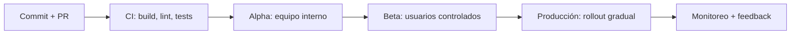
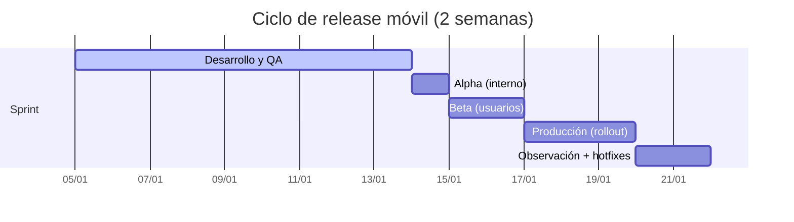
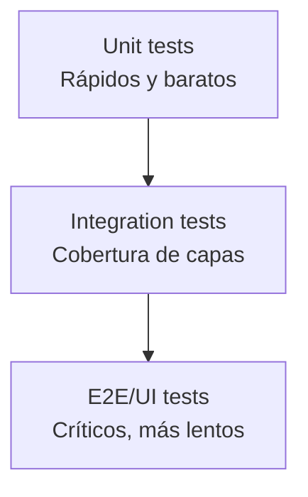
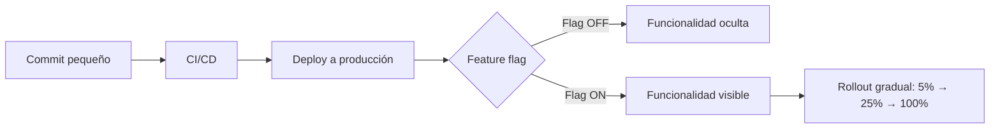

# La importancia de la calidad en el desarrollo de aplicaciones móviles

El pasado 29 de octubre de 2025 tuve la oportunidad de participar en el programa Cyber Break de TVN Radio donde hablé sobre la importancia de la calidad en el desarrollo de aplicaciones móviles y cómo podemos mejorarla. En el mundo móvil existen retos distintos a los de otras plataformas: la fragmentación de dispositivos, la conectividad variable y las restricciones de tiendas hacen que un bug pequeño se convierta en una pérdida de usuarios y reputación. No quería dejar pasar la oportunidad de compartir este tema con todos ustedes.

En este artículo quiero aterrizar una guía práctica: qué entendemos por calidad, por qué impacta el negocio, qué retos existen en el desarrollo de aplicaciones móviles y cuáles son las prácticas concretas que elevan la estabilidad en producción.

## ¿Por qué la calidad de software es importante en mi aplicación móvil?

La importancia de la calidad de software puede verse claramente en aplicaciones sensitivas como software médico o aeroespacial. Si algo falla, esto puede causar la muerte de un paciente o la caída de un avión. Por lo tanto, es fundamental que la calidad de software sea alta para garantizar la seguridad y la fiabilidad de la aplicación.


En el caso de las aplicaciones móviles, la calidad de software es crítica porque existe una gran competencia en el mercado. Si un usuario percibe mala calidad (crashes, bugs, pantallas lentas), tiende a abandonar la app, dejar una mala reseña y no volver. Eso afecta el posicionamiento en la tienda, reduce descargas orgánicas y eleva el costo de adquisición de usuarios.

Un [estudio realizado por la empresa Bugsnag en 2021](https://smartbear.com/news/news-releases/bugsnag-application-stability-index-report-reveals/) encontró una correlación entre las aplicaciones con alta estabilidad (99% de sesiones crash-free) y altos ratings en las tiendas. Esto nos dice que la calidad de software es un factor clave para el éxito de tu aplicación.

**Calidad no es solo “no tener bugs”**. También incluye: rendimiento, accesibilidad, seguridad, diseño consistente y una experiencia predecible bajo condiciones reales (batería baja, red intermitente, versiones antiguas).

## Retos en el desarrollo de aplicaciones móviles

En su libro ["Building Mobile Apps at Scale"](https://www.mobileatscale.com/), Gergely Orosz describe una serie de retos (39 en la últma versión) frecuentes en móvil. Algunos de los más relevantes son:

- La larga cola de versiones antiguas
- Conectividad inestable y offline
- Crashes y ANRs
- Manejo de estado complejo y múltiples fuentes de datos
- Diferencias de hardware y sistema operativo (fragmentación)

### La larga cola de las versiones antiguas de las aplicaciones

La larga cola de versiones antiguas es un reto importante. Los usuarios pueden permanecer semanas (o meses) sin actualizar. Eso obliga a mantener compatibilidad con APIs viejas, schemas de datos y flujos que ya no están en el roadmap. Un buen proceso de *release* debe tener estrategias de migración gradual y comunicación con backend. Ántes de que la nueva versión sea publicada en producción, se debe tener un plan de migración gradual para que cualquier tipo de error crítico sea detectado y corregido antes de que el usuarios en producción lo noten. 

Existen aplicaciones, como por ejemplo aplicaciones bancarias, que bloquean la aplicación si los usuarios no han actualizado a la última versión. También las tiendas están lanzando nuevos features que ayudan a los usuarios a actualizar a la última versión de la aplicación. Por ejemplo, Google Play ofrece ["In-app updates"](https://developer.android.com/guide/playcore/in-app-updates) para que los usuarios puedan actualizar la aplicación sin tener que descargar la nueva versión desde la tienda.


### Conectividad intermitente

Cuando desarrollas una aplicación móvil, debes tener en cuenta que la conectividad es variable y que el usuario puede estar en cualquier parte del mundo. Por lo tanto, tu aplicación debe ser capaz de manejar la conectividad intermitente y offline. La experiencia real incluye túneles, ascensores, áreas sin señal o redes saturadas. Si no se maneja correctamente la conectividad, se puede presentar un estado de la aplicación que no es el esperado por el usuario o simplemente ofrecer una experiencia de usuario (UX) pobre. 


Tu app debe manejar múltiples aspectos críticos de la conectividad sin bloquear la UI:

**Timeouts**: Define tiempos de espera apropiados para cada operación de red (típicamente 5-30 segundos dependiendo de la acción). Sin timeouts, las operaciones pueden quedarse colgadas indefinidamente, consumiendo recursos y degradando la experiencia. Implementa timeouts diferentes según la criticidad: operaciones rápidas como búsquedas deben fallar rápido, mientras que descargas pesadas pueden tener ventanas más largas.

**Retry with backoff**: Cuando una petición falla (por timeout o error de red), no intentes inmediatamente de nuevo. Implementa una estrategia de reintentos con backoff exponencial (ej: esperar 1s, luego 2s, luego 4s antes de reintentar). Esto evita saturar la red cuando hay problemas temporales y reduce el consumo de batería. Limita el número máximo de intentos (3-5 típicamente) para evitar bucles infinitos.

**Cache local**: Guarda datos críticos localmente para permitir que la app funcione offline o con conexión lenta. Estrategias comunes incluyen cache de respuestas HTTP (con validación de stale-while-revalidate), cache de imágenes y assets, y persistencia de estado de la app. El cache debe tener una política de invalidación clara: datos sensibles al tiempo (como precios) deben refrescarse frecuentemente, mientras que contenido estático puede persistir por días.

**Estados offline**: Diseña tu app para detectar y manejar explícitamente la falta de conectividad. Muestra indicadores visuales claros cuando el usuario está offline, permite operaciones que pueden hacerse localmente (lectura, edición de formularios), y sincroniza cambios pendientes cuando la conectividad se restaura. Implementa colas de operaciones pendientes para acciones que requieren red.

**Sin bloquear la UI**: Todas estas operaciones deben ejecutarse en hilos en segundo plano o de forma asíncrona. El hilo principal (UI thread) nunca debe esperar operaciones de red. Usa callbacks, promesas o corrutinas según tu stack tecnológico, y muestra estados de carga apropiados sin congelar la interfaz. [Kotlin coroutines](https://kotlinlang.org/docs/coroutines-overview.html) es una excelente opción para manejar la asincronía en Android. Ofrece una API de alto nivel para manejar la asincronía de manera sencilla y eficiente.

La experiencia del usuario debe ser consistente independientemente de la conectividad: la app debe sentirse responsiva y predecible tanto con 5G como con WiFi lento o sin conexión. Un usuario en un túnel debe poder seguir navegando contenido previamente cargado sin notar diferencias abruptas. 


### Crashes y ANRs

Un **crash** es una falla inesperada que hace que la aplicación se cierre abruptamente sin una notificación previa al usuario. Es decir, la app deja de funcionar y el sistema operativo la termina forzosamente. Un crash puede ocurrir por falta de memoria, errores de concurrencia o dependencias externas o un Null Pointer Exception. 

En Android, los **ANRs (Application Not Responding)** representan un bloqueo de la aplicación por más de 5 segundos en el cuál el usuario no puede interactuar con la aplicación. Esto destruye completamente la experiencia del usuario con su aplicación. Este tipo de errores son críticos y deben ser monitoreados continuamente porque pueden afectar a gran cantidad de usuarios, lo que conlleva que los mismos usuarios no vuelvan a usar la aplicación y dejen una mala reseña en la tienda.

La calidad exige monitoreo continuo y límites de tiempo para operaciones pesadas.

### Manejo de estado complejo

A diferencia del desarrollo web y backend, donde el ciclo de vida de la aplicación no es un problema crítico, en móvil debemos manejar constantes transiciones de ciclo de vida. La aplicación puede ser enviada al background cuando el usuario cambia a otra app, y luego regresar al foreground cuando vuelve. Más aún, el sistema operativo puede recuperar memoria cuando hay presión, lo que en algunos casos termina la aplicación por completo. Cuando el usuario vuelve a abrirla, la app debe restaurar su estado previo de manera transparente.


*Imagen de ["Building Mobile Apps at Scale"](https://www.mobileatscale.com/)*

En móvil convivimos con múltiples capas: UI, cache local, red, push notifications y deep links. Sin una estrategia clara de estado (unidireccional, fuentes de verdad), aparecen inconsistencias difíciles de depurar. La mayoría de bugs y crashes pasan por
combinaciones de eventos no esperadas o no probadas 

## Mejorando la calidad de software en mi aplicación móvil

Para mejorar la calidad de software en una app móvil, propongo una estrategia que combine procesos, automatización y medición. No se trata de agregar herramientas al azar, sino de construir un sistema de calidad end-to-end.

### 1) Procesos de despliegue en etapas

Lanzar a todos los usuarios al mismo tiempo es riesgoso. En móvil, la liberación por etapas permite detectar problemas antes de un impacto masivo. Un flujo típico incluye Alpha (equipo interno), Beta (usuarios de confianza) y Producción.

Gráfico del flujo de despliegue:



Cadencia sugerida: ciclos de 2 semanas, con ventanas de observación entre etapas.



#### Google Play Console (Android)

Google Play ofrece un sistema completo de tracks para despliegues por etapas:

- **Internal testing**: Hasta 100 testers internos. Los builds están disponibles inmediatamente sin revisión de Google. Ideal para pruebas del equipo de desarrollo y QA.
- **Closed testing (Alpha/Beta)**: Permite crear grupos cerrados de usuarios por email o Google Groups. Los builds pasan por una revisión rápida. Útil para pruebas con stakeholders o usuarios de confianza.
- **Open testing**: Cualquier usuario puede unirse al programa de pruebas desde la página de la app en Play Store. Bueno para obtener feedback de una audiencia más amplia antes del lanzamiento general.
- **Staged rollouts**: Una vez en producción, puedes liberar a un porcentaje de usuarios (1%, 5%, 10%, 50%, etc.) y aumentar gradualmente. Si detectas problemas en el monitoreo, puedes pausar el rollout o hacer rollback a la versión anterior.

Google Play Console también proporciona métricas de Android Vitals (crash rate, ANR rate, battery usage) que te permiten comparar la estabilidad entre versiones durante el rollout.

#### App Store Connect (iOS)

Apple ofrece herramientas similares a través de TestFlight y phased releases:

- **TestFlight Internal**: Hasta 100 miembros del equipo con rol de App Manager, Developer, Marketer o Admin. Los builds están disponibles inmediatamente después de procesarse.
- **TestFlight External**: Hasta 10,000 testers externos por app. Requiere revisión de Apple (generalmente 24-48 horas para el primer build de un grupo). Puedes crear múltiples grupos con diferentes builds.
- **Phased Release**: Al publicar en producción, puedes activar "Phased Release for Automatic Updates" que distribuye la actualización gradualmente durante 7 días (1%, 2%, 5%, 10%, 20%, 50%, 100%). Los usuarios que buscan actualizaciones manualmente la obtienen inmediatamente, pero las actualizaciones automáticas se distribuyen gradualmente. Puedes pausar el rollout si detectas problemas.

TestFlight permite recopilar feedback directo de los testers a través de la app, incluyendo screenshots y comentarios, lo que facilita identificar problemas antes de producción.

#### Recomendaciones para ambas plataformas

1. **Automatiza la distribución**: Usa herramientas como Fastlane para subir builds automáticamente a los tracks de testing desde tu CI/CD.
2. **Define criterios de promoción**: Establece métricas mínimas (crash-free rate > 99.5%, no P0 bugs) antes de avanzar al siguiente track.
3. **Monitorea activamente durante rollouts**: Ten dashboards listos con las métricas clave y alertas configuradas para detectar regresiones.
4. **Documenta el proceso de rollback**: Asegúrate de que cualquier miembro del equipo pueda pausar un rollout o revertir a una versión anterior si es necesario.

### 2) Mantener alta mantenibilidad del código

La calidad empieza con un código fácil de cambiar sin miedo. Esto incluye:
- Arquitectura clara (por ejemplo, MVVM, MVI o Clean)
- Módulos bien definidos y bajo acoplamiento
- Dependencias actualizadas y con versiones controladas

A medida que la aplicación crece, es importante mantener la mantenibilidad del código. Esto implica que el código debe ser fácil de entender, de mantener y de cambiar. Las aplicaciones móviles son desarrolladas como monolitos, pero es importante que el código sea modularizable para que se pueda mantener y cambiar fácilmente. Esto permite que el equipo de desarrollo pueda trabajar en diferentes partes de la aplicación de manera independiente y sin afectar el resto de la aplicación y también mejora la experiencia de desarrollo (DX) ya que, si modularizado correctamente, los tiempos de compilación y pruebas pueden reducirse cuando se trabaja sobre el proyecto. 

El uso de herramientas de análisis estático y de linting ayuda a mantener el código limpio y libre de errores. Herramientas como [SonarQube](https://www.sonarqube.org/), [Detekt](https://github.com/detekt/detekt) y [Android Lint](https://developer.android.com/studio/write/lint) son excelentes opciones para mantener el código limpio y libre de errores obvios. Estas herramientas permiten extenderlas con sus propias reglas y métricas que se ajustan a las necesidades de su equipo y aplicación. 

### 3) Suite de pruebas robusta (pirámide de testing)

No necesitas tests de UI para todo. Una estrategia balanceada reduce costos y aumenta confianza:
- **Unitarias** para lógica de negocio
- **Integración** para bases de datos y APIs
- **End-to-end** para flujos críticos (login, pago, onboarding)


*Imagen de ["Your QA tester’s hierarchy of needs: what is the agile testing pyramid?"](https://www.onpathtesting.com/blog/qa-testers-what-is-the-agile-testing-pyramid/)*



#### Screenshot Testing

Una técnica complementaria a la pirámide de testing es el **screenshot testing** (también conocido como snapshot testing visual). Consiste en renderizar componentes de UI y compararlos pixel a pixel contra imágenes de referencia ("golden images"). Si hay diferencias, el test falla y genera un diff visual que muestra exactamente qué cambió.

**¿Por qué usar screenshot testing?**

- **Detecta regresiones visuales** que los tests unitarios no pueden capturar (cambios de colores, márgenes, tipografías, layouts rotos).
- **Documenta visualmente** cómo se ven los componentes en diferentes estados (loading, error, vacío, con datos).
- **Más rápido que E2E**: los screenshots se generan sin necesidad de un dispositivo físico o emulador completo, ejecutándose como tests unitarios.
- **Facilita code reviews**: los revisores pueden ver exactamente cómo afectan los cambios a la UI.

**Paparazzi (Android)**

[Paparazzi](https://github.com/cashapp/paparazzi) es una librería de Cash App que permite renderizar pantallas Android sin necesidad de un dispositivo físico o emulador. Utiliza el layoutlib de Android Studio para generar screenshots directamente en la JVM.

```kotlin
class LaunchViewTest {
  @get:Rule
  val paparazzi = Paparazzi(
    deviceConfig = PIXEL_5,
    theme = "android:Theme.Material.Light.NoActionBar"
  )

  @Test
  fun launchComposable() {
    paparazzi.snapshot {
      MyComposable()
    }
  }
}
```

Con Paparazzi puedes:
- Grabar snapshots de referencia con `./gradlew recordPaparazziDebug`
- Verificar contra los snapshots existentes con `./gradlew verifyPaparazziDebug`
- Ver diffs visuales cuando hay diferencias en `build/paparazzi/failures`

**SnapshotTesting (iOS)**

[SnapshotTesting](https://github.com/pointfreeco/swift-snapshot-testing) de Point-Free es la librería de referencia para screenshot testing en iOS. Es altamente flexible y permite hacer snapshots no solo de vistas, sino también de cualquier tipo de dato (JSON, strings, etc.).

```swift
import SnapshotTesting
import XCTest

class MyViewControllerTests: XCTestCase {
  func testMyViewController() {
    let vc = MyViewController()
    
    assertSnapshot(of: vc, as: .image(on: .iPhone13))
  }
  
  func testMySwiftUIView() {
    let view = MySwiftUIView()
    
    assertSnapshot(of: view, as: .image(layout: .device(config: .iPhone13)))
  }
}
```

La librería soporta múltiples estrategias de snapshot:
- `.image`: captura visual de la vista
- `.recursiveDescription`: descripción jerárquica de la vista (útil para accesibilidad)
- `.json`, `.dump`: para snapshots de datos estructurados

**Recomendaciones para screenshot testing**

1. **Usa Git LFS** para almacenar las imágenes de referencia, ya que pueden crecer rápidamente y afectar el rendimiento del repositorio.
2. **Organiza los snapshots por componente** para facilitar la revisión y mantenimiento.
3. **Testea estados clave**: no solo el estado "happy path", sino también loading, error, vacío y edge cases visuales.
4. **Integra en CI/CD**: ejecuta los tests de screenshots en cada PR para detectar regresiones antes del merge.
5. **Actualiza snapshots intencionalmente**: cuando cambies la UI a propósito, actualiza los snapshots y documenta el cambio en el PR.

### 4) Feature flags + cambios pequeños y frecuentes

Implementar funcionalidades detrás de flags permite lanzar código a producción sin exponer la funcionalidad a todos los usuarios. Un **feature flag** es simplemente una condición en el código que determina si una funcionalidad está activa o no, controlada remotamente o por configuración.

```kotlin
// Ejemplo simplificado de feature flag
if (featureFlags.isEnabled("new_checkout_flow")) {
    showNewCheckoutFlow()
} else {
    showLegacyCheckoutFlow()
}
```

#### Feature flags y trunk-based development

Los feature flags son especialmente poderosos cuando se combinan con **trunk-based development**, una estrategia donde todos los desarrolladores trabajan directamente sobre la rama principal (main/trunk) en lugar de crear feature branches de larga duración.

**El problema de los feature branches largos:**

Cuando una funcionalidad toma semanas o meses en desarrollarse, el feature branch diverge significativamente de main. Esto genera:
- **Merge conflicts masivos**: mientras más tiempo pasa, más cambios se acumulan en ambas ramas y más difícil es reconciliarlos.
- **Integración tardía de bugs**: los problemas de integración solo se descubren al momento del merge, cuando ya es costoso corregirlos.
- **Riesgo elevado**: un merge grande introduce muchos cambios a la vez, aumentando la probabilidad de regresiones.
- **Bloqueo del equipo**: otros desarrolladores no pueden beneficiarse de refactors o mejoras hasta que el branch se mergee.

**La solución: trunk-based development + feature flags**

Con esta combinación, puedes:
1. **Hacer commits pequeños y frecuentes a main**: cada cambio es incremental y fácil de revisar.
2. **Ocultar funcionalidades incompletas**: el código está en producción pero desactivado detrás de un flag.
3. **Integrar continuamente**: los conflictos se resuelven diariamente en lugar de acumularse.
4. **Activar gradualmente**: cuando la funcionalidad está lista, activas el flag para un porcentaje de usuarios y monitoreas.



#### Tipos de feature flags

- **Release flags**: controlan el lanzamiento de nuevas funcionalidades. Se eliminan una vez que la funcionalidad está al 100%.
- **Experiment flags**: para A/B testing y experimentos. Permiten medir el impacto de cambios.
- **Ops flags**: "kill switches" para desactivar funcionalidades problemáticas en producción sin necesidad de deploy.
- **Permission flags**: controlan acceso a funcionalidades premium o por tipo de usuario.

#### Herramientas para feature flags

- **Firebase Remote Config**: integrado con el ecosistema Firebase, gratis para volúmenes moderados.
- **LaunchDarkly**: plataforma robusta con targeting avanzado, ideal para equipos grandes.
- **Unleash**: open source, self-hosted, buena opción si necesitas control total.
- **Implementación propia**: para casos simples, un endpoint en tu backend puede ser suficiente.

#### Recomendaciones

1. **Limpia los flags obsoletos**: los feature flags tienen un costo de mantenimiento. Una vez que una funcionalidad está al 100%, elimina el flag y el código legacy.
2. **Documenta cada flag**: mantén un registro de qué hace cada flag, quién lo creó y cuándo debería eliminarse.
3. **Testea ambos estados**: asegúrate de que tu suite de pruebas cubra tanto el caso con flag ON como OFF.
4. **No abuses**: demasiados flags activos simultáneamente crean complejidad. Mantén el número manejable.

### 5) Monitoreo y observabilidad

Es difícil detectar todos los fallos antes del release. Por más completa que sea tu suite de pruebas, los usuarios encontrarán combinaciones de dispositivos, versiones de OS y condiciones de red que no anticipaste. Por eso, necesitas monitoreo continuo de:

- **Crashes y ANRs**: captura automática de excepciones con stack traces completos y contexto del dispositivo.
- **Errores de red**: timeouts, respuestas HTTP erróneas, fallos de conectividad.
- **Métricas de performance**: cold start, tiempo de render, uso de memoria, consumo de batería.
- **Eventos de negocio**: funnel de conversión, tasas de abandono, features más usados.

#### Herramientas de crash reporting

**[Sentry](https://sentry.io/)**: plataforma de monitoreo de errores que soporta múltiples plataformas (Android, iOS, React Native, Flutter). Captura crashes, errores no fatales y permite agregar breadcrumbs (rastros de navegación del usuario antes del error). Ofrece agrupación inteligente de errores similares y alertas configurables.

**[Bugsnag](https://www.bugsnag.com/)**: similar a Sentry, con fuerte enfoque en estabilidad móvil. Proporciona el "Application Stability Score" que mide el porcentaje de sesiones sin crashes. Integra bien con herramientas de CI/CD para correlacionar releases con cambios en estabilidad.

**[Firebase Crashlytics](https://firebase.google.com/products/crashlytics)**: solución gratuita de Google, integrada con el ecosistema Firebase. Ideal si ya usas Firebase para analytics, remote config o push notifications. Ofrece reportes en tiempo real, agrupación automática de crashes y métricas de usuarios afectados.

#### Herramientas de performance monitoring

**[Firebase Performance Monitoring](https://firebase.google.com/products/performance)**: mide automáticamente tiempos de inicio, renderizado de pantallas y latencia de red. Permite crear traces personalizados para medir operaciones específicas.

**[Sentry Performance](https://sentry.io/for/performance/)**: además de crash reporting, Sentry ofrece monitoreo de transacciones y traces distribuidos para entender el performance end-to-end.

**Android Vitals y App Store Connect Metrics**: las propias tiendas ofrecen métricas de calidad. Google Play Console muestra crash rate, ANR rate, y métricas de batería/wake locks. App Store Connect muestra crashes, hang rate y métricas de disco/memoria.

#### Recomendaciones para monitoreo efectivo

1. **Configura alertas proactivas**: no esperes a que los usuarios reporten. Configura alertas cuando el crash rate supere un umbral o cuando aparezca un nuevo tipo de error.
2. **Incluye contexto útil**: agrega información como versión de la app, tipo de usuario, pantalla actual y acciones recientes (breadcrumbs).
3. **Prioriza por impacto**: no todos los crashes son iguales. Enfócate primero en los que afectan más usuarios o en flujos críticos.
4. **Correlaciona con releases**: usa las integraciones con CI/CD para saber exactamente qué commit introdujo una regresión.
5. **Revisa métricas regularmente**: incluye la revisión de crash rate y ANR rate en tus rituales de equipo (daily, weekly).

### 6) Seguridad y privacidad desde el diseño

La calidad también incluye proteger datos y cumplir regulaciones:
- Cifrado en tránsito y en reposo
- Mínimos permisos necesarios
- Revisión de dependencias con vulnerabilidades conocidas

### 7) Automatización en CI/CD

Una pipeline bien diseñada evita errores humanos y reduce tiempos:
- Lint + análisis estático
- Tests en paralelo
- Builds reproducibles
- Distribución automática a testers

## Checklist de release antes de producción

Antes de publicar, valida esta lista mínima:
- Crash-free sessions > 99%
- ANR rate bajo y estable
- Pruebas E2E críticas en verde
- Cambios documentados para soporte y producto
- Plan de rollback definido

## Métricas que recomiendo seguir

Medir la calidad es lo que permite mejorarla de forma continua:
- Crash-free sessions
- ANR rate
- Tiempo de arranque (cold start)
- Tasa de errores por endpoint
- NPS o ratings en la tienda

## Conclusión

La calidad en aplicaciones móviles no es un estado final, sino un sistema. Con procesos por etapas, pruebas balanceadas, observabilidad y un enfoque de mejora continua, es posible reducir fallas y construir experiencias confiables que los usuarios valoren.

- Procesos de despliegue en etapas
- Mantener un alta mantenibilidad del código
- Mantener un suite de pruebas robusta
- Utilizar feature flags para lanzar nuevas funcionalidades de manera controlada. Esto en conjunto con un manejo de cambios pequeños y frecuentes.
- Utilizar un sistema de monitoreo de errores para detectar y corregir errores rápidamente. Es bien dificil detectar todos las posibles fallas en una aplicación móvil, por lo que es importante tener un sistema de monitoreo de errores que nos permita detectar y corregir errores rápidamente.