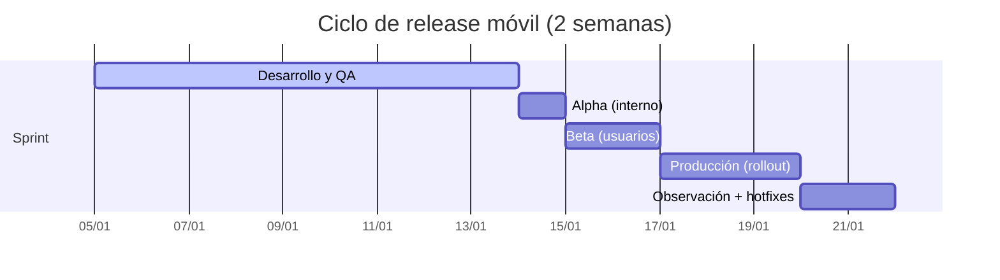
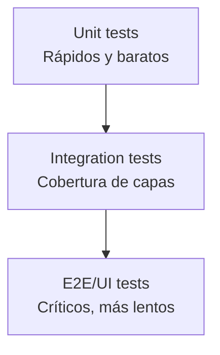

# La importancia de la calidad en el desarrollo de aplicaciones móviles

El pasado 29 de octubre de 2025 tuve la oportunidad de participar en el programa Cyber Break de TVN Radio donde hablé sobre la importancia de la calidad en el desarrollo de aplicaciones móviles y cómo podemos mejorarla. En el mundo móvil existen retos distintos a los de otras plataformas: la fragmentación de dispositivos, la conectividad variable y las restricciones de tiendas hacen que un bug pequeño se convierta en una pérdida de usuarios y reputación.

En este artículo quiero aterrizar una guía práctica: qué entendemos por calidad, por qué impacta el negocio y cuáles son las prácticas concretas que elevan la estabilidad en producción.

## ¿Por qué la calidad de software es importante en mi aplicación móvil?

La importancia de la calidad de software puede verse claramente en aplicaciones sensitivas como software médico o aeroespacial. Si algo falla, esto puede causar la muerte de un paciente o la caída de un avión. Por lo tanto, es fundamental que la calidad de software sea alta para garantizar la seguridad y la fiabilidad de la aplicación.

En el caso de las aplicaciones móviles, la calidad de software es crítica porque existe una gran competencia en el mercado. Si un usuario percibe mala calidad (crashes, bugs, pantallas lentas), tiende a abandonar la app, dejar una mala reseña y no volver. Eso afecta el posicionamiento en la tienda, reduce descargas orgánicas y eleva el costo de adquisición de usuarios.

Un estudio realizado por la empresa Bugsnag en 2021 encontró una correlación entre las aplicaciones con alta estabilidad (99% de sesiones crash-free) y altos ratings en las tiendas. Esto nos dice que la calidad de software es un factor clave para el éxito.

**Calidad no es solo “no tener bugs”**. También incluye: rendimiento, accesibilidad, seguridad, diseño consistente y una experiencia predecible bajo condiciones reales (batería baja, red intermitente, versiones antiguas).

## Retos en el desarrollo de aplicaciones móviles

En su libro "Building Mobile Apps at Scale", Gergely Orosz describe una serie de retos frecuentes en móvil. Algunos de los más relevantes son:

- La larga cola de versiones antiguas
- Conectividad inestable y offline
- Crashes y ANRs
- Manejo de estado complejo y múltiples fuentes de datos
- Diferencias de hardware (RAM, CPU, tamaño de pantalla)

### La larga cola de las versiones antiguas de las aplicaciones

La larga cola de versiones antiguas es un reto importante. Los usuarios pueden permanecer semanas (o meses) sin actualizar. Eso obliga a mantener compatibilidad con APIs viejas, schemas de datos y flujos que ya no están en el roadmap. Un buen proceso de *release* debe tener estrategias de migración gradual y comunicación con backend.

### Conectividad intermitente

La experiencia real incluye túneles, ascensores, áreas sin señal o redes saturadas. Tu app debe manejar *timeouts*, *retry with backoff*, cache local y estados offline sin bloquear la UI.

### Crashes y ANRs

Un crash puede ocurrir por falta de memoria, errores de concurrencia o dependencias externas. En Android, los ANRs (Application Not Responding) destruyen la experiencia. La calidad exige monitoreo continuo y límites de tiempo para operaciones pesadas.

### Manejo de estado complejo

En móvil convivimos con múltiples capas: UI, cache local, red, push notifications y deep links. Sin una estrategia clara de estado (unidireccional, fuentes de verdad), aparecen inconsistencias difíciles de depurar.

## Mejorando la calidad de software en mi aplicación móvil

Para mejorar la calidad de software en una app móvil, propongo una estrategia que combine procesos, automatización y medición. No se trata de agregar herramientas al azar, sino de construir un sistema de calidad end-to-end.

### 1) Procesos de despliegue en etapas

Lanzar a todos los usuarios al mismo tiempo es riesgoso. En móvil, la liberación por etapas permite detectar problemas antes de un impacto masivo. Un flujo típico incluye Alpha (equipo interno), Beta (usuarios de confianza) y Producción.

Gráfico del flujo de despliegue:

Cadencia sugerida: ciclos de 2 semanas, con ventanas de observación entre etapas.

### 2) Mantener alta mantenibilidad del código

La calidad empieza con un código fácil de cambiar sin miedo. Esto incluye:
- Arquitectura clara (por ejemplo, MVVM, MVI o Clean)
- Módulos bien definidos y bajo acoplamiento
- Dependencias actualizadas y con versiones controladas

### 3) Suite de pruebas robusta (pirámide de testing)

No necesitas tests de UI para todo. Una estrategia balanceada reduce costos y aumenta confianza:
- **Unitarias** para lógica de negocio
- **Integración** para bases de datos y APIs
- **End-to-end** para flujos críticos (login, pago, onboarding)

### 4) Feature flags + cambios pequeños y frecuentes

Implementar funcionalidades detrás de flags permite lanzar sin exponer a todos los usuarios. Además, cambios pequeños reducen el riesgo y facilitan el rollback.

### 5) Monitoreo y observabilidad

Es difícil detectar todos los fallos antes del release. Por eso, necesitas monitoreo de:
- Crashes y ANRs
- Errores de red
- Métricas de performance (cold start, tiempo de render)
- Eventos de negocio (funnel, conversiones)

### 6) Seguridad y privacidad desde el diseño

La calidad también incluye proteger datos y cumplir regulaciones:
- Cifrado en tránsito y en reposo
- Mínimos permisos necesarios
- Revisión de dependencias con vulnerabilidades conocidas

### 7) Automatización en CI/CD

Una pipeline bien diseñada evita errores humanos y reduce tiempos:
- Lint + análisis estático
- Tests en paralelo
- Builds reproducibles
- Distribución automática a testers

## Checklist de release antes de producción

Antes de publicar, valida esta lista mínima:
- Crash-free sessions > 99%
- ANR rate bajo y estable
- Pruebas E2E críticas en verde
- Cambios documentados para soporte y producto
- Plan de rollback definido

## Métricas que recomiendo seguir

Medir la calidad es lo que permite mejorarla de forma continua:
- Crash-free sessions
- ANR rate
- Tiempo de arranque (cold start)
- Tasa de errores por endpoint
- NPS o ratings en la tienda

## Conclusión

La calidad en aplicaciones móviles no es un estado final, sino un sistema. Con procesos por etapas, pruebas balanceadas, observabilidad y un enfoque de mejora continua, es posible reducir fallas y construir experiencias confiables que los usuarios valoren.

- Procesos de despliegue en etapas
- Mantener un alta mantenibilidad del código
- Mantener un suite de pruebas robusta
- Utilizar feature flags para lanzar nuevas funcionalidades de manera controlada. Esto en conjunto con un manejo de cambios pequeños y frecuentes.
- Utilizar un sistema de monitoreo de errores para detectar y corregir errores rápidamente. Es bien dificil detectar todos las posibles fallas en una aplicación móvil, por lo que es importante tener un sistema de monitoreo de errores que nos permita detectar y corregir errores rápidamente.